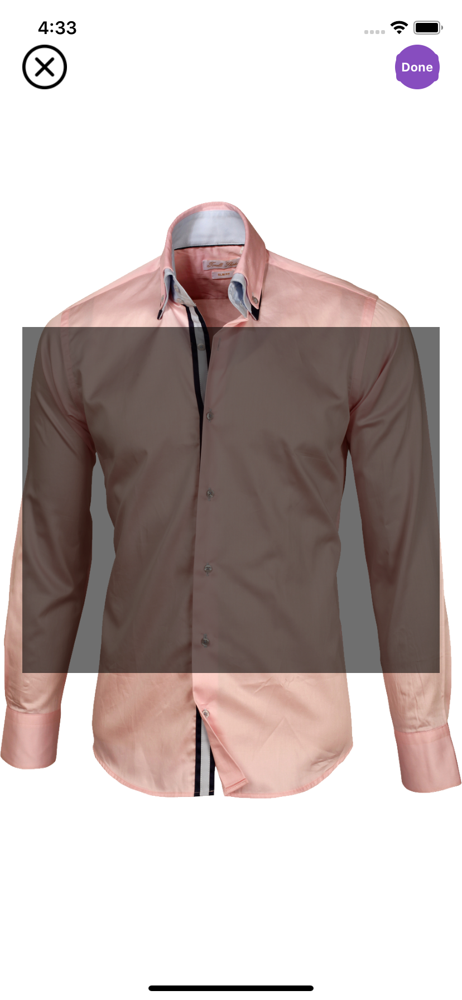

# FyndTask

Hey, here I have created a #TogaStore as a demo. 
Having some cool features I hope It may help you in some way in your projects. You can watch the video attached to this post. 
#features 
1. #CollectionView inside #UITableView
2. #switch to convert Grid view to List view.
3. Download the Image from the #url and #Caching using #Kingfisher #SDK.
4. Sort Grid view products by #name  and #price 
5. Zoom in and out on double click.
6. Zoom in and out on Finger pinch.
7. #crop selected part of the #image 
8. UITAbleView as a Menu and Sub Menu.


What I used:-
1. #mvvm architecture
2. #swift  with #uikit 
YOU CAN DOWNLOAD THIS PROJECT FROM GITHUB
GitHub Link:- https://github.com/kumarlav0/MyDressStore 
#github #help #architecture #ios #iosdevelopment #iosdeveloper #swift #swiftdeveloper #objectivec Apple 

<li>
<h2>All Screen</h2>
      

</li>
